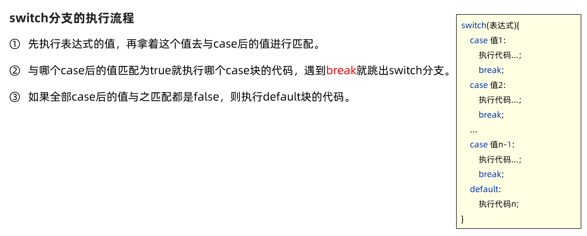
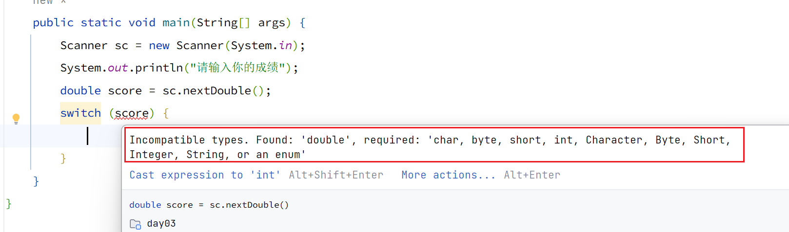

# Day03

## 前一天记录

### 两个数字交换

- way1 使用temp进行交换
```java 
int a = 23;
int b = 78;
int temp = a;
a = b;
b = temp; 
```

- way2 使用按位异或进行交换
```java
// 通过位运算(异或运算)交换两个变量的值
// 按位异或： 两个操作数相同结果是0 不同是 1
int a = 23;
int b = 25;
// a ^ a = 0;
// a ^ 0 = a;
a = a ^ b;
b = a ^ b;  // a ^ b ^ b = a ^ 0 = a
a = a ^ b;  // a ^ b ^ a = 0 ^ b = b
```
- way3 
```java
int a = 23;
int b = 45;
a = a + b;
b = a - b;  // a + b - b = a
a = a - b;  // a + b - a = b
```
## intellij快捷键
psvm
```java
public static void main(String[] args){}
```
sout
```java
System.out.println();
```
# 程序流程控制

## 顺序结构
就是不加任何控制，代码从main方法开始自上而下执行
## 分支结构
根据条件判断是true还是false
Java语言中提供了两个格式if 、 switch

### if分支
if它的作用，是用于对条件进行判断，判断的结果只可能有两个值true或者false，然后 根据条件判断的结果来决定执行那段代码。
- 单分支if结构
```java
public static void main(String[] args) {
    double temp = 36;
    if (temp > 37) {
    System.out.println("枪毙");
    }
    System.out.println("继续执行代码");
    }
```
- 双分支if结构
```java
public static void main(String[] args) {
    double temp = 36;
    if (temp > 37) {
    System.out.println("枪毙");
    } else {
    System.out.println("隔离28天");
    }
    System.out.println("语句执行完毕");
    }
```
- 双分支if结构
```java
Scanner sc = new Scanner(System.in);
System.out.println("请输入员工打分成绩");
double score = sc.nextDouble();
if (score >= 0 && score < 60) {
    System.out.println("员工绩效级别：D");
} else if (score < 80) {
    System.out.println("员工绩效级别：C");
} else if (score < 90) {
    System.out.println("员工绩效级别：B");
} else if (score <= 100) {
    System.out.println("员工绩效级别：A");
} else {
    System.out.println("你输入的成绩不合理");
}
System.out.println("绩效评定完毕");
```

### switch分支
- switch分支的执行流程: switch 分支的作用，是通过比较值来决定执行哪条分支代码。先看一下switch分支的格式和执行流程
```java
switch(表达式){
    case1:执行代码1;
        break;
    case2:执行代码2；
        break;
    default:默认情况，与上述条件都不匹配的时候；
}
```

```java
javac -encoding utf-8 Switch01.java
//输出utf-8代码
```

#### switch 注意事项
各位同学，接下来我们学习switch的注意事项。同学们掌握这些注意事项之后，就可 以避免入坑了，也可以应对一些面试笔试题。
- 表达式类型只能是byte、short、int、char；JDK5开始支持枚举，JDK7开始支持String，不支持double、float, long等 
- case给出的值不允许重复，且只能是字面量，不能是变量。 
- 正常使用switch的时候，不要忘记写break，否则会出现穿透现象。
 
switch语句匹配的数据类型
- 可以自己分别用变量a、b放在switch语句中匹配试一试，如果遇到不支持的写法，编译会报错


case后面的值，只能是字面量不能是变量
```java
int i = 20;
int d = 20;
switch(i) {
case 10:
// 省略部分代码
break;
case d: ---- `d`不可用
// 省略部分代码
break;
```


case穿透现象
- 当switch语句中没有遇到break，就会直接穿透到下一个case语句执行，直到遇到break 为止
```java
//案例3：使用switch-case实现：对学生成绩大于60分的，输出“合格”。低于60分的，输出“不合格”。
int score = 59;
switch (score / 10) {
    case 10:
    case 9:
    case 8:
    case 7:
    case 6:
        System.out.println("及格");
        break;
    case 5:
    case 4:
    case 3:
    case 2:
    case 1:
    case 0:
        System.out.println("不及格");
    default:
        break;
```

case匹配多个值

当多个case语句想要执行同一段代码时，可以利用
```java
switch (month) {
    case 1, 3, 5, 7, 8, 10, 12:
        System.out.println("31天");
        break;
    case 4, 6, 9, 11:
        System.out.println("30天");
        break;
    case 2:
        System.out.println(feb + "天");
        break;
    default:
        System.out.println("输入错误");
        break;
}
```

switch分支新特性

- 箭头表达式
- 特性2：yield
```java
// 先输入年份，在输入一个月份，返回这个月多少天
// 31 30 29 2831 1,3,5,7,8,10,12 30 4，6 ，9，11 2 年29天 平年 28天

Scanner scanner = new Scanner(System.in);
System.out.println("请输入一个年份");
int year = scanner.nextInt();

int days = 0;
System.out.println("请输入一个月份");
int month = scanner.nextInt();
days = switch (month) {
    case 1, 3, 5, 7, 8, 10, 12 -> 31;
    case 4, 6, 9, 11 -> 30;
    case 2 -> {
        if (year % 4 == 0 && year % 100 != 0 || year % 400 == 0) {
            yield 29;
        } else {
            yield 28;
        }
    }
    default -> -1;
    //default 不能忘记加
};
if (days == -1) {
    System.out.println("你输入的有误");
}
else {
    System.out.println(year+"年 "+month+"月 有"+days+"天");

}

```


## 循环结构
在Java语言中提供了三种格式，
for、while、do-while还有1.5新增的for-each循环

# 杂项
## asci码

| 十六进制 | 十进制 | 二进制 | 字符 |
|-|-|-|-|  
| 00 | 0 | 00000000 | NUL(空字符) |
| 01 | 1 | 00000001 | SOH(标题开始) |
| 02 | 2 | 00000010 | STX(正文开始) |
| 03 | 3 | 00000011 | ETX(正文结束) |
| 04 | 4 | 00000100 | EOT(传输结束) |
| 05 | 5 | 00000101 | ENQ(请求) |
| 06 | 6 | 00000110 | ACK(回应) |
| 07 | 7 | 00000111 | BEL(响铃) |
| 08 | 8 | 00001000 | BS(退格) | 
| 09 | 9 | 00001001 | HT(水平制表符) |
| 0A | 10 | 00001010 | LF(换行键) |
| 0B | 11 | 00001011 | VT(垂直制表符) |
| 0C | 12 | 00001100 | FF(换页键) |
| 0D | 13 | 00001101 | CR(回车键) |
| 0E | 14 | 00001110 | SO(不用切换) |
| 0F | 15 | 00001111 | SI(启用切换) |
| 10 | 16 | 00010000 | DLE(数据链路转义) |
| 11 | 17 | 00010001 | DC1(传输开始) |
| 12 | 18 | 00010010 | DC2(设备控制2) | 
| 13 | 19 | 00010011 | DC3(传输中断) |
| 14 | 20 | 00010100 | DC4(设备控制4) |
| 15 | 21 | 00010101 | NAK(无响应) |
| 16 | 22 | 00010110 | SYN(同步空闲) |
| 17 | 23 | 00010111 | ETB(传输块结束) |
| 18 | 24 | 00011000 | CAN(取消) |
| 19 | 25 | 00011001 | EM(介质中断) |
| 1A | 26 | 00011010 | SUB(替补) |
| 1B | 27 | 00011011 | ESC(逃离) |  
| 1C | 28 | 00011100 | FS(文件分割符) |
| 1D | 29 | 00011101 | GS(组分隔符) |
| 1E | 30 | 00011110 | RS(记录分隔符) |
| 1F | 31 | 00011111 | US(单元分隔符) |
| 20 | 32 | 00100000 |  (空格) |
| 21 | 33 | 00100001 | ! |
| 22 | 34 | 00100010 | " |
| 23 | 35 | 00100011 | # |
| 24 | 36 | 00100100 | $ |
| 25 | 37 | 00100101 | % |
| 26 | 38 | 00100110 | & |
| 27 | 39 | 00100111 | ' |
| 28 | 40 | 00101000 | ( |
| 29 | 41 | 00101001 | ) |
| 2A | 42 | 00101010 | * |
| 2B | 43 | 00101011 | + | 
| 2C | 44 | 00101100 | , |
| 2D | 45 | 00101101 | - |
| 2E | 46 | 00101110 | . |
| 2F | 47 | 00101111 | / |
| 30 | 48 | 00110000 | 0 |
| 31 | 49 | 00110001 | 1 |  
| 32 | 50 | 00110010 | 2 |
| 33 | 51 | 00110011 | 3 |
| 34 | 52 | 00110100 | 4 |
| 35 | 53 | 00110101 | 5 |
| 36 | 54 | 00110110 | 6 |
| 37 | 55 | 00110111 | 7 |
| 38 | 56 | 00111000 | 8 |
| 39 | 57 | 00111001 | 9 |
| 3A | 58 | 00111010 | : |
| 3B | 59 | 00111011 | ; |
| 3C | 60 | 00111100 | < |
| 3D | 61 | 00111101 | = |
| 3E | 62 | 00111110 | > |
| 3F | 63 | 00111111 | ? |
| 40 | 64 | 01000000 | @ |
| 41 | 65 | 01000001 | A |
| 42 | 66 | 01000010 | B |
| 43 | 67 | 01000011 | C |  
| 44 | 68 | 01000100 | D |
| 45 | 69 | 01000101 | E | 
| 46 | 70 | 01000110 | F |
| 47 | 71 | 01000111 | G |
| 48 | 72 | 01001000 | H |
| 49 | 73 | 01001001 | I |
| 4A | 74 | 01001010 | J |
| 4B | 75 | 01001011 | K |
| 4C | 76 | 01001100 | L |
| 4D | 77 | 01001101 | M |
| 4E | 78 | 01001110 | N |
| 4F | 79 | 01001111 | O |
| 50 | 80 | 01010000 | P |
| 51 | 81 | 01010001 | Q |
| 52 | 82 | 01010010 | R |
| 53 | 83 | 01010011 | S |
| 54 | 84 | 01010100 | T |  
| 55 | 85 | 01010101 | U |
| 56 | 86 | 01010110 | V |
| 57 | 87 | 01010111 | W |
| 58 | 88 | 01011000 | X |
| 59 | 89 | 01011001 | Y |
| 5A | 90 | 01011010 | Z |
| 5B | 91 | 01011011 | [ |
| 5C | 92 | 01011100 | \ |
| 5D | 93 | 01011101 | ] |
| 5E | 94 | 01011110 | ^ |
| 5F | 95 | 01011111 | _ |
| 60 | 96 | 01100000 | ` |
| 61 | 97 | 01100001 | a |
| 62 | 98 | 01100010 | b |
| 63 | 99 | 01100011 | c |
| 64 | 100 | 01100100 | d |
| 65 | 101 | 01100101 | e |  
| 66 | 102 | 01100110 | f |
| 67 | 103 | 01100111 | g |
| 68 | 104 | 01101000 | h |
| 69 | 105 | 01101001 | i |
| 6A | 106 | 01101010 | j |
| 6B | 107 | 01101011 | k |
| 6C | 108 | 01101100 | l |
| 6D | 109 | 01101101 | m |
| 6E | 110 | 01101110 | n |
| 6F | 111 | 01101111 | o |
| 70 | 112 | 01110000 | p |
| 71 | 113 | 01110001 | q |
| 72 | 114 | 01110010 | r |
| 73 | 115 | 01110011 | s |
| 74 | 116 | 01110100 | t |
| 75 | 117 | 01110101 | u |
| 76 | 118 | 01110110 | v |
| 77 | 119 | 01110111 | w |  
| 78 | 120 | 01111000 | x |
| 79 | 121 | 01111001 | y |
| 7A | 122 | 01111010 | z |
| 7B | 123 | 01111011 | { |
| 7C | 124 | 01111100 | | |
| 7D | 125 | 01111101 | } |
| 7E | 126 | 01111110 | ~ |
| 7F | 127 | 01111111 | DEL(删除) |

## Java中的引号


