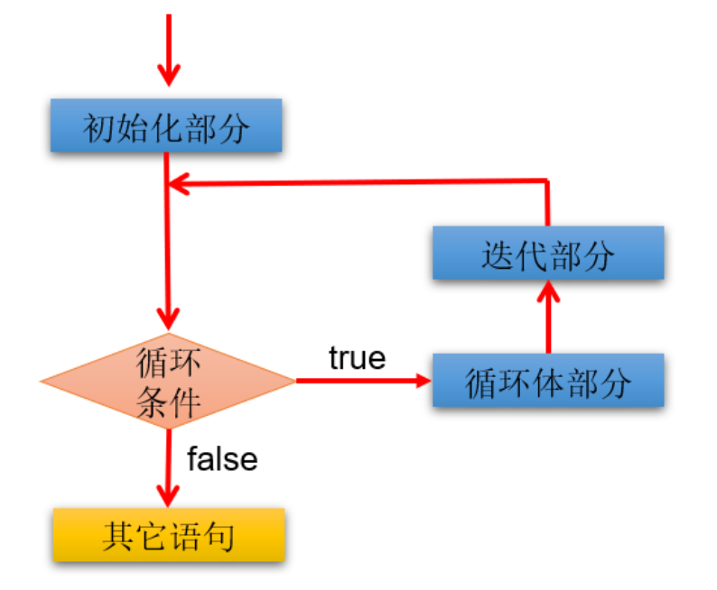
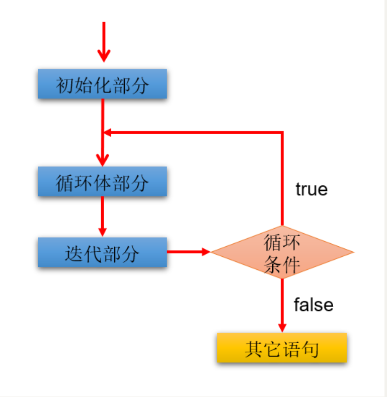

# Day04 循环结构

## for循环

### 基本语法

**语法格式：**


```java
for (①初始化部分; ②循环条件部分; ④迭代部分)｛
         	③循环体部分;
｝
```

**执行过程：**①-②-③-④-②-③-④-②-③-④-.....-②

**图示：**


**说明：**

- for(;;)中的两个；不能多也不能少
- ①初始化部分可以声明多个变量，但必须是同一个类型，用逗号分隔
- ②循环条件部分为boolean类型表达式，当值为false时，退出循环
- ④可以有多个变量更新，用逗号分隔

#### 3.1.2 应用举例

**案例1：使用for循环重复执行某些语句**

题目：输出5行HelloWorld

```java
public class ForTest1 {
    public static void main(String[] args) {
        //需求1：控制台输出5行Hello World!
		//写法1：
		//System.out.println("Hello World!");
		//System.out.println("Hello World!");
		//System.out.println("Hello World!");
		//System.out.println("Hello World!");
		//System.out.println("Hello World!");

		//写法2：
		for(int i = 1;i <= 5;i++){
			System.out.println("Hello World!");
		}
    }
}
```

**案例2：格式的多样性**

题目：写出输出的结果

```java
public class ForTest2 {
	public static void main(String[] args) {
        int num = 1;
        for(System.out.print("a");num < 3;System.out.print("c"),num++){
            System.out.print("b");

        }
    }
}
```

**案例3：累加的思想**

题目：遍历1-100以内的偶数，并获取偶数的个数，获取所有的偶数的和

```java
public class ForTest3 {
	public static void main(String[] args) {
        int count = 0;//记录偶数的个数
        int sum = 0;//记录偶数的和

        for(int i = 1;i <= 100;i++){

            if(i % 2 == 0){
                System.out.println(i);
                count++;
                sum += i;
            }	

            //System.out.println("偶数的个数为：" + count);
        }

        System.out.println("偶数的个数为：" + count);	
        System.out.println("偶数的总和为：" + sum);
    }
}
```

**案例4：结合分支结构使用**

题目：输出所有的水仙花数，所谓水仙花数是指一个3位数，其各个位上数字立方和等于其本身。例如： `153 = 1*1*1 + 3*3*3 + 5*5*5`

```java
public class ForTest4 {
	public static void main(String[] args) {
		//定义统计变量，初始化值是0
		int count = 0;
		
		//获取三位数，用for循环实现
		for(int x = 100; x < 1000; x++) {
			//获取三位数的个位，十位，百位
			int ge = x % 10;
			int shi = x / 10 % 10;
			int bai = x / 100;
			
			//判断这个三位数是否是水仙花数，如果是，统计变量++
			if((ge*ge*ge+shi*shi*shi+bai*bai*bai) == x) {
                System.out.println("水仙花数：" + x);
				count++;
			}
		}
		
		//输出统计结果就可以了
		System.out.println("水仙花数共有"+count+"个");
	}
}
```

拓展：

```
打印出四位数字中“个位+百位”等于“十位+千位”并且个位数为偶数，千位数为奇数的数字，并打印符合条件的数字的个数。
```

**案例5：结合break的使用**

说明：输入两个正整数m和n，求其最大公约数和最小公倍数。

比如：12和20的最大公约数是4，最小公倍数是60。

```java
/**
 * @author 尚硅谷-宋红康
 * @create 17:43
 */
public class ForTest5 {
    public static void main(String[] args) {
        //需求1：最大公约数
        int m = 12, n = 20;
        //取出两个数中的较小值
        int min = (m < n) ? m : n;

        for (int i = min; i >= 1; i--) {//for(int i = 1;i <= min;i++){

            if (m % i == 0 && n % i == 0) {
                System.out.println("最大公约数是：" + i); //公约数

                break; //跳出当前循环结构
            }
        }


        //需求2：最小公倍数
        //取出两个数中的较大值
        int max = (m > n) ? m : n;

        for (int i = max; i <= m * n; i++) {

            if (i % m == 0 && i % n == 0) {

                System.out.println("最小公倍数是：" + i);//公倍数

                break;
            }
        }

    }
}
```

> 说明：
>
> 1、我们可以在循环中使用break。一旦执行break，就跳出当前循环结构。
>
> 2、小结：如何结束一个循环结构？
>
> ​      结束情况1：循环结构中的循环条件部分返回false
>
> ​      结束情况2：循环结构中执行了break。
>
> 3、如果一个循环结构不能结束，那就是一个死循环！我们开发中要避免出现死循环。

#### 3.1.3 练习

**练习1：**打印1~100之间所有奇数的和

```java
public class ForExer1 {

    public static void main(String[] args) {

        int sum = 0;//记录奇数的和
        for (int i = 1; i < 100; i++) {
            if(i % 2 != 0){
                sum += i;
            }
        }
        System.out.println("奇数总和为：" + sum);
    }
}
```

**练习2：**打印1~100之间所有是7的倍数的整数的个数及总和（体会设置计数器的思想）

```java
public class ForExer2 {

    public static void main(String[] args) {

        int sum = 0;//记录总和
        int count = 0;//记录个数
        for (int i = 1; i < 100; i++) {
            if(i % 7 == 0){
                sum += i;
                count++;
            }
        }
        System.out.println("1~100之间所有是7的倍数的整数的和为：" + sum);
        System.out.println("1~100之间所有是7的倍数的整数的个数为：" + count);
    }
}
```

**练习3：**

编写程序从1循环到150，并在每行打印一个值，另外在每个3的倍数行上打印出“foo”,在每个5的倍数行上打印“biz”,在每个7的倍数行上打印输出“baz”。


```java
public class ForExer3 {

    public static void main(String[] args) {

        for (int i = 1; i < 150; i++) {
            System.out.print(i + "\t");
            if(i % 3 == 0){
                System.out.print("foo\t");
            }
            if(i % 5 == 0){
                System.out.print("biz\t");
            }
            if(i % 7 == 0){
                System.out.print("baz\t");
            }

            System.out.println();
        }
    }
}
```


## while循环
**语法格式：**

```java
①初始化部分
while(②循环条件部分)｛
    ③循环体部分;
    ④迭代部分;
}
```

**执行过程：**①-②-③-④-②-③-④-②-③-④-...-②

**图示：**


**说明：**

- while(循环条件)中循环条件必须是boolean类型。
- 注意不要忘记声明④迭代部分。否则，循环将不能结束，变成死循环。
- for循环和while循环可以相互转换。二者没有性能上的差别。实际开发中，根据具体结构的情况，选择哪个格式更合适、美观。
- for循环与while循环的区别：初始化条件部分的作用域不同。


### 应用举例

**案例1：**输出5行HelloWorld!

```java
class WhileTest1 {
	public static void main(String[] args) {
		
		int i = 1;
		while(i <= 5){
			System.out.println("Hello World!");
			i++;
		}
	}
}
```

**案例2：**遍历1-100的偶数，并计算所有偶数的和、偶数的个数（累加的思想）

```java
class WhileTest2 {
	public static void main(String[] args) {
		//遍历1-100的偶数，并计算所有偶数的和、偶数的个数（累加的思想）
		int num = 1;

		int sum = 0;//记录1-100所有的偶数的和
		int count = 0;//记录1-100之间偶数的个数

		while(num <= 100){
			
			if(num % 2 == 0){
				System.out.println(num);
				sum += num;
				count++;
			}
			
			//迭代条件
			num++;
		}
	
		System.out.println("偶数的总和为：" + sum);
		System.out.println("偶数的个数为：" + count);
	}
}
```

**案例3：**猜数字游戏

```
随机生成一个100以内的数，猜这个随机数是多少？

从键盘输入数，如果大了，提示大了；如果小了，提示小了；如果对了，就不再猜了，并统计一共猜了多少次。

提示：生成一个[a,b] 范围的随机数的方式：(int)(Math.random() * (b - a + 1) + a)
```

```java
/**
 * @author 尚硅谷-宋红康
 * @create 16:42
 */
public class GuessNumber {
    public static void main(String[] args) {
        //获取一个随机数
        int random = (int) (Math.random() * 100) + 1;

        //记录猜的次数
        int count = 1;

        //实例化Scanner
        Scanner scan = new Scanner(System.in);
        System.out.println("请输入一个整数(1-100):");
        int guess = scan.nextInt();

        while (guess != random) {

            if (guess > random) {
                System.out.println("猜大了");
            } else if (guess < random) {
                System.out.println("猜小了");
            }

            System.out.println("请输入一个整数(1-100):");
            guess = scan.nextInt();
			//累加猜的次数
            count++;

        }

        System.out.println("猜中了！");
        System.out.println("一共猜了" + count + "次");
    }
}
```

**案例4：折纸珠穆朗玛峰**

```
世界最高山峰是珠穆朗玛峰，它的高度是8848.86米，假如我有一张足够大的纸，它的厚度是0.1毫米。
请问，我折叠多少次，可以折成珠穆朗玛峰的高度?
```

```java
/**
 * @author 尚硅谷-宋红康
 * @create 19:08
 */
public class ZFTest {
    public static void main(String[] args) {
        //定义一个计数器，初始值为0
        int count = 0;

        //定义珠穆朗玛峰的高度
        int zf = 8848860;//单位：毫米

        double paper = 0.1;//单位：毫米

        while(paper < zf){
            //在循环中执行累加，对应折叠了多少次
            count++;
            paper *= 2;//循环的执行过程中每次纸张折叠，纸张的厚度要加倍
        }

        //打印计数器的值
        System.out.println("需要折叠：" + count + "次");
        System.out.println("折纸的高度为" + paper/1000 + "米，超过了珠峰的高度");
    }
}
```

#### 3.2.3 练习

**练习：**从键盘输入整数，输入0结束，统计输入的正数、负数的个数。

```java
import java.util.Scanner;

public class Test05While {
    public static void main(String[] args) {
        Scanner input = new Scanner(System.in);

        int positive = 0; //记录正数的个数
        int negative = 0;  //记录负数的个数
        int num = 1; //初始化为特殊值，使得第一次循环条件成立
        while(num != 0){
            System.out.print("请输入整数（0表示结束）：");
            num = input.nextInt();

            if(num > 0){
                positive++;
            }else if(num < 0){
                negative++;
            }
        }
        System.out.println("正数个数：" + positive);
        System.out.println("负数个数：" + negative);

        input.close();
    }
}

```

## do-while循环

### 3.3.1 基本语法

**语法格式：**

```java
①初始化部分;
do{
	③循环体部分
	④迭代部分
}while(②循环条件部分); 
```

**执行过程：**①-③-④-②-③-④-②-③-④-...-②

**图示：**


**说明：**

- 结尾while(循环条件)中循环条件必须是boolean类型
- do{}while();最后有一个分号
- do-while结构的循环体语句是至少会执行一次，这个和for和while是不一样的
- 循环的三个结构for、while、do-while三者是可以相互转换的。

###应用举例

**案例1：**遍历1-100的偶数，并计算所有偶数的和、偶数的个数（累加的思想）

```java
class DoWhileTest1 {
	public static void main(String[] args) {

		//遍历1-100的偶数，并计算所有偶数的和、偶数的个数（累加的思想）
		//初始化部分
		int num = 1;
		
		int sum = 0;//记录1-100所有的偶数的和
		int count = 0;//记录1-100之间偶数的个数

		do{
			//循环体部分
			if(num % 2 == 0){
				System.out.println(num);
				sum += num;
				count++;
			}
			
			num++;//迭代部分


		}while(num <= 100); //循环条件部分


		System.out.println("偶数的总和为：" + sum);
		System.out.println("偶数的个数为：" + count);
	}
}

```

**案例2：**体会do-while至少会执行一次循环体

```java
class DoWhileTest2 {
	public static void main(String[] args) {
        //while循环:
		int num1 = 10;
		while(num1 > 10){
			System.out.println("hello:while");
			num1--;
		}

		//do-while循环:
		int num2 = 10;
		do{
			System.out.println("hello:do-while");
			num2--;
		}while(num2 > 10);

	}
}
```

**案例3：ATM取款**

```
声明变量balance并初始化为0，用以表示银行账户的余额，下面通过ATM机程序实现存款，取款等功能。

=========ATM========
   1、存款
   2、取款
   3、显示余额
   4、退出
请选择(1-4)：
```

```java
import java.util.Scanner;

/**
 * @author 尚硅谷-宋红康
 * @create 19:12
 */
public class ATM {
	public static void main(String[] args) {

		//初始化条件
		double balance = 0.0;//表示银行账户的余额
		Scanner scan = new Scanner(System.in);
		boolean isFlag = true;//用于控制循环的结束

		do{
			System.out.println("=========ATM========");
			System.out.println("\t1、存款");
			System.out.println("\t2、取款");
			System.out.println("\t3、显示余额");
			System.out.println("\t4、退出");
			System.out.print("请选择(1-4)：");

			int selection = scan.nextInt();
			
			switch(selection){
				case 1:
					System.out.print("要存款的额度为：");
					double addMoney = scan.nextDouble();
					if(addMoney > 0){
						balance += addMoney;
					}
					break;
				case 2:
					System.out.print("要取款的额度为：");
					double minusMoney = scan.nextDouble();
					if(minusMoney > 0 && balance >= minusMoney){
						balance -= minusMoney;
					}else{
						System.out.println("您输入的数据非法或余额不足");
					}
					break;
				case 3:
					System.out.println("当前的余额为：" + balance);
					break;
				case 4:
					System.out.println("欢迎下次进入此系统。^_^");
					isFlag = false;
					break;
				default:
					System.out.println("请重新选择！");
					break;	
			}
		
		}while(isFlag);

		//资源关闭
		scan.close();
		
	}
}
```

###练习

**练习1：**随机生成一个100以内的数，猜这个随机数是多少？

从键盘输入数，如果大了提示，大了；如果小了，提示小了；如果对了，就不再猜了，并统计一共猜了多少次。

```java
import java.util.Scanner;

public class DoWhileExer {
    public static void main(String[] args) {
        //随机生成一个100以内的整数
		/*
		Math.random() ==> [0,1)的小数
		Math.random()* 100 ==> [0,100)的小数
		(int)(Math.random()* 100) ==> [0,100)的整数
		*/
        int num = (int)(Math.random()* 100);
        //System.out.println(num);

        //声明一个变量，用来存储猜的次数
        int count = 0;

        Scanner input = new Scanner(System.in);
        int guess;//提升作用域
        do{
            System.out.print("请输入100以内的整数：");
            guess = input.nextInt();

            //输入一次，就表示猜了一次
            count++;

            if(guess > num){
                System.out.println("大了");
            }else if(guess < num){
                System.out.println("小了");
            }
        }while(num != guess);

        System.out.println("一共猜了：" + count+"次");

        input.close();
    }
}
```


