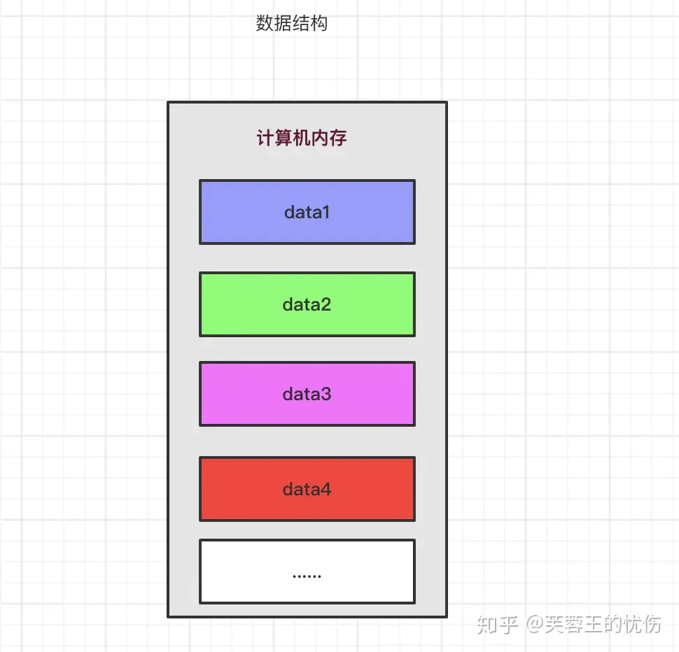
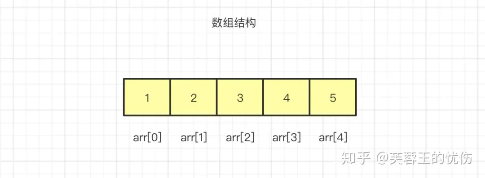
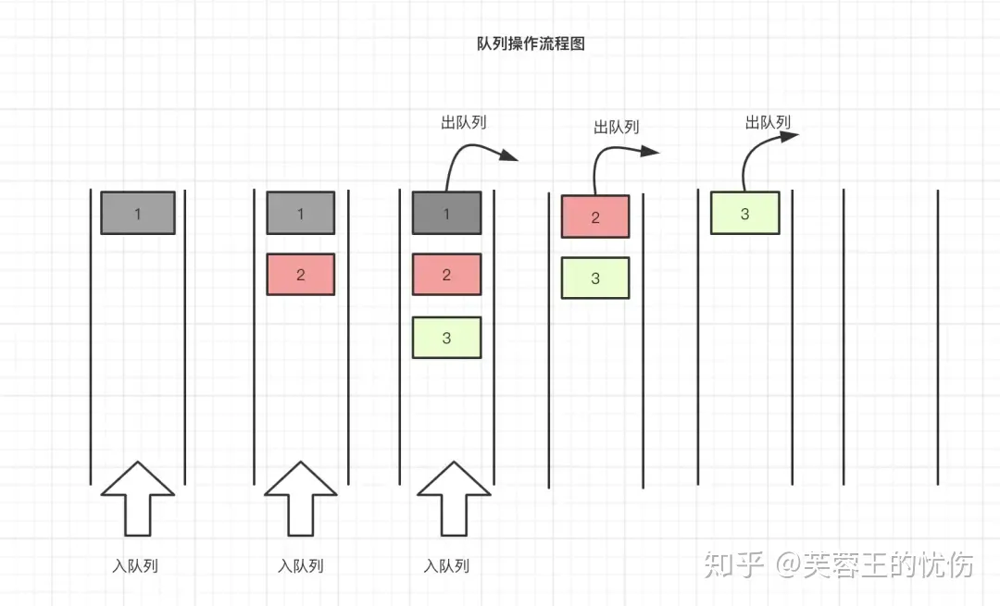
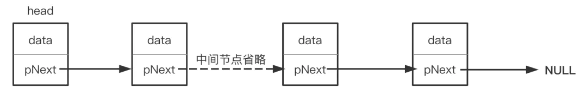
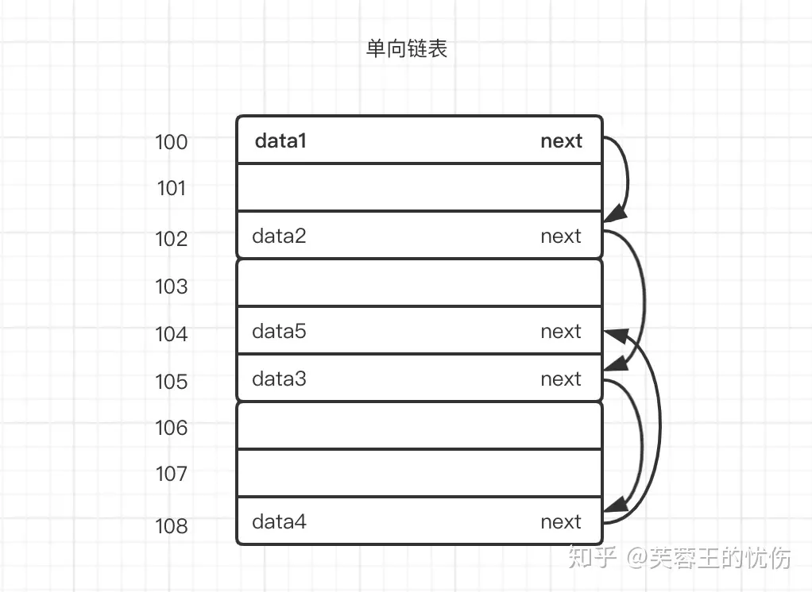
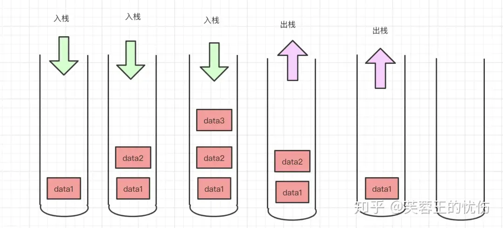
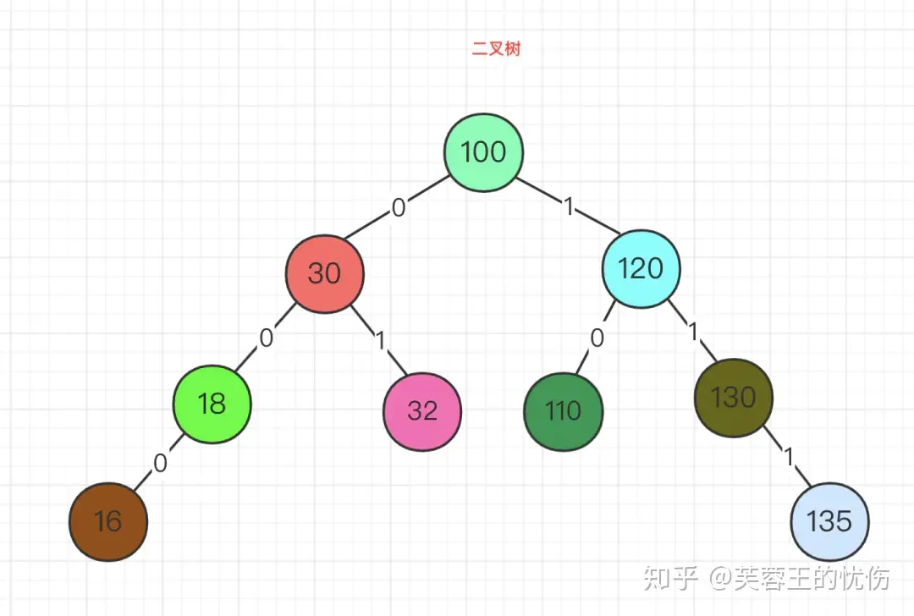
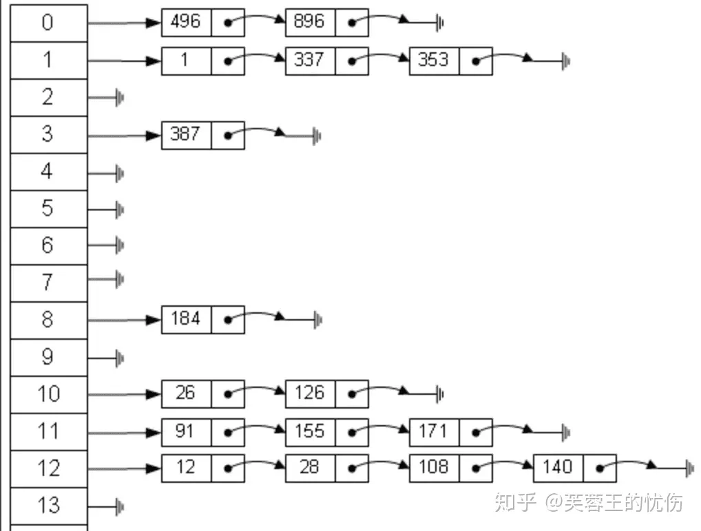
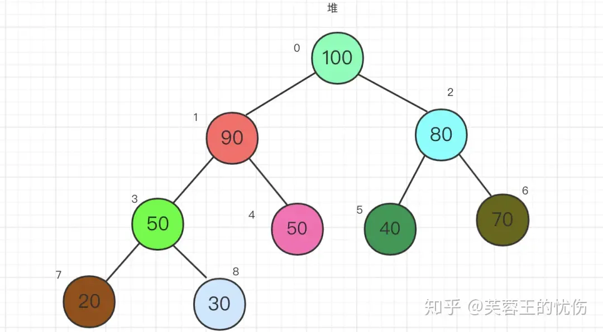
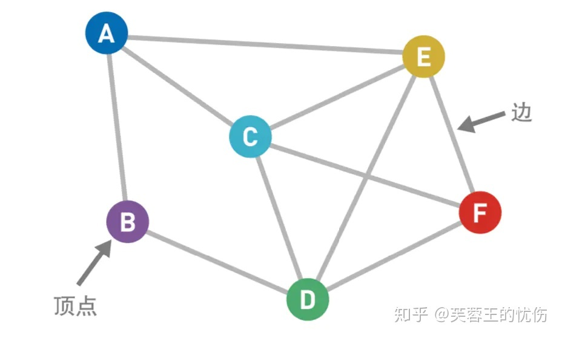

# 什么是数据结构？

数据结构(data structure)是带有结构特性的数据元素的集合，它研究的是数据的逻辑结构和数据的物理结构以及它们之间的相互关系，并对这种结构定义相适应的运算，设计出相应的算法，并确保经过这些运算以后所得到的新结构仍保持原来的结构类型。简而言之，数据结构是相互之间存在一种或多种特定关系的数据元素的集合，即带“结构”的数据元素的集合。“结构”就是指数据元素之间存在的关系，分为逻辑结构和存储结构。

## 数据结构分为逻辑结构和物理结构。

- 逻辑结构：指数据元素之间逻辑关系的数据结构，这里的逻辑关系是指数据元素之间的前后间关系，与数据在计算机中的存储位置无关。
- 物理结构：指数据的逻辑结构在计算机存储空间中的存放形式称为数据的物理结构，也叫做存储结构。

## 数据的逻辑结构主要分为线性结构和非线性结构。 

- 线性结构：数据结构的元素之间存在一对一线性关系，所有结点都最多只有一个直接前趋结点和一个直接后继结点。常见的有数组、队列、链表、栈。
- 非线性结构：各个结点之间具有多个对应关系，一个结点可能有多个直接前趋结点和多个直接后继结点。常见的有多维数组、广义表、树结构和图结构等。

数据的物理结构（以后我都统一称存储结构），表示数据元素之间的逻辑关系，一种数据结构的逻辑结构根据需要可以表示成多种存储结构，常用的存储结构有：
- 顺序存储：存储顺序是连续的，在内存中用一组地址连续的存储单元依次存储线性表的各个数据元素。
- 链式存储：在内存中的存储元素不一定是连续的，用任意地址的存储单元存储元素，元素节点存放数据元素以及通过指针指向相邻元素的地址信息。
- 索引存储：除建立存储结点信息外，还建立附加的索引表来标识节点的地址。索引表由若干索引项组成。
- 散列存储：又称Hash存储，由节点的关键码值决定节点的存储地址。

## 常用的数据结构
* 数组（Array）
* 队列（Queue）
* 链表（Linked List）
* 栈（Stack）
* 树（Tree）
* 散列表（Hash）
* 堆（Heap）
* 图（Graph）

下面我们来先对这几个数据结构有个大概的印象

### 数组（Array）
数组是最简单、使用最频繁的一种数据结构。它一种线性表数据结构，用一组连续的内存空间来存储一组相同类型的数据。

如上图所示，数据是按照顺序存储在内存的连续空间内，arr后面的[]代表下标，由于数据是存储在连续空间内的，所以每个数据的内存地址(在内存上的位置)都可以通过数组下标计算出来，从而可以直接访问目标数据，达到随机访问的目的。

### 队列（Queue）
队列也是一种非常基础的数据结构，其特点是先入先出，也就是我们常听到的FIFO（First in First Out），即操作数据是从两端进行的。

### 链表（Linked List）
链表是一种物理存储单元上非连续，非顺序的存储结构。链表有一系列节点组成，所谓节点就是指链表中的每一个元素，每个节点包含两个数据，一个是存储元素的数据域（值），另一个是存储下一个节点地址的指针域。

通俗点说，链表数据一般都是分散存储于内存中 的，无须存储在连续空间内。这样大家可能还不能直观的感受链表的非连续，我再画一张图：

假设上图中100-108是一块内存中连续地址的内存分布，假设101、103、106、107这几个内存地址都已经存储数据了，那剩下的100、102、104、105、108是不是就浪费呢，答案是否定的，我们可以使用链表的方式存储数据。

### 栈（Stack）
栈也是一种数据呈线性排列的数据结构，和上面的队列相反，栈的特点先进后出、后进先出，就是常说的LIFO（Last in First Out）。

### 树（Tree）
树形结构是一种层级式的数据结构，由顶点（节点）和连接它们的边组成。

数的结构特点是：

1. 每个节点有零个或多个子节点；
2. 没有父节点的节点称为根节点；
3. 每一个非根节点有且只有一个父节点；
4. 除了根节点外，每个子节点可以分为多个不相交的子树。

我们平时用到最多的就是二叉树，我也以二叉树来为例，先看一下树结构：

二叉树有几下特点：

1. 每个结点最多有两颗子树，结点的度最大为2。
2. 左子树和右子树是有顺序的，次序不能颠倒。
3. 即使某结点只有一个子树，也要区分左右子树。
4. 个结点的值均大于其左子树上任意一个结点的值。比如 点的值。结点100大于其左子树上的30，18和16。
5. 每个结点的值均小于其右子树上任意 一个结点的值。比如结点 100 小于其右子树上的 120、130 和 135。

### 散列表（Hash）
散列表又叫哈希表，存储的是由键(key)和值(value)组 成的数据，根据键直接访问存储在内存存储位置的数据结构。

从图中可以看出，左边很明显是个数组，数组的每个成员包括一个指针，指向一个链表的头，当然这个链表可能为空，也可能元素很多。我们根据元素的一些特征把元素分配到不同的链表中去，也是根据这些特征，找到正确的链表，再从链表中找出这个元素。哈希表查找数据的公式为：记录的存储位置=f(key)这里的对应关系 f 成为散列函数，又称为哈希 (hash函数)，而散列表就是把Key通过一个固定的算法函数既所谓的哈希函数转换成一个整型数字，然后就将该数字对数组长度进行取余，取余结果就当作数组的下标，将value存储在以该数字为下标的数组空间里，这种存储空间可以充分利用数组的查找优势来查找元素，所以查找的速度很快。我们将在后面详细讲解哈希表数据结构。

### 堆（Heap）

堆比较特殊，是一种图的树形结构。被用于实现“优先队列”(priority queues)，优先队列是一种数据结构，可以自由添加数据，但取出数据时要从最小值开始按顺 序取出。在堆的树形结构中，各个顶点被称为“结点”(node)，数据就存储在这些结点中。

只要满足下面两个特点的树形结构就是堆：

* 堆是一个完全二叉树（所谓完全二叉树就是除了最后一层其他层的节点个数都是满的）。
* 堆中每一个节点的值都必须大于等于或者小于其子树中每一个节点的值。

下面我们看一下堆的结构：

上面其实叫大顶堆，如果每一个节点小于子树中每个节点的值，那就叫小顶堆。

### 图（Graph）

图是相对复杂的一种数据结构，由顶点和连接每对顶点的边所构成的图形就是图。
我们先来看图：

上图中的圆圈叫作“顶点”(Vertex，也叫“结点”)，连接顶点的线叫作“边”（Edge）。也就是说，由顶点和连接每对顶点的边所构成的图形就是图。 图按照顶点指向的方向可分为无向图和有向图，像我上面的就叫无向图。 图在存储数据上有着比较复杂和高效的算法，分别有邻接矩阵 、邻接表、十字链表、邻接多重表、边集数组等存储结构。常见的图遍历算法就是广度优先算法和深度优先算法。

# Reference
知乎 芙蓉王的忧伤 （转载）一文十三张图带你彻底了解所有数据结构
https://zhuanlan.zhihu.com/p/138523723

简书 永远在晴天 （原作者）一文十三张图带你彻底了解所有数据结构
https://www.jianshu.com/p/6b03035bbd19

