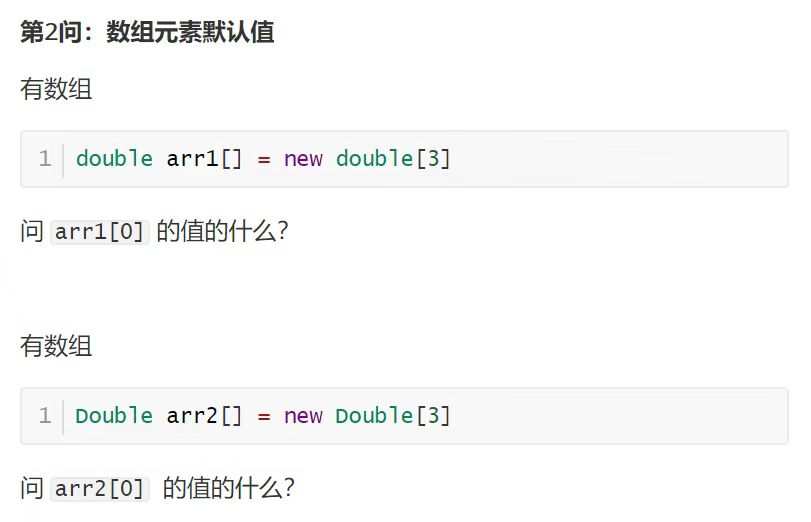
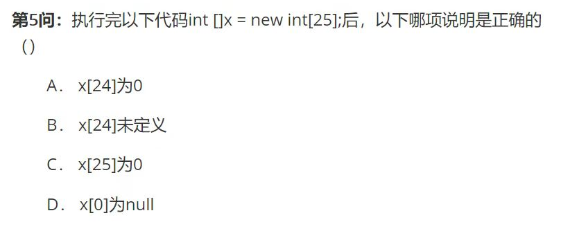
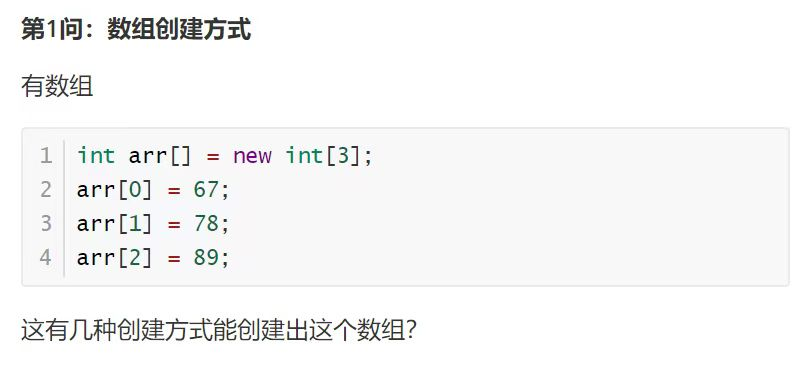
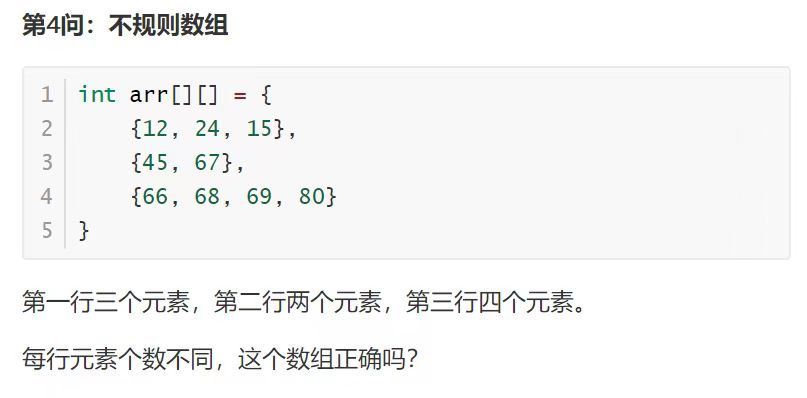

5.A

1.

静态初始化

动态初始化

2.
arr1[0]=0.0;
arr2[0]=null;

# 3.数组的扩充
way1：复制到新数组

way2： 使用可变数组 ArrayList
ArrayList的大小是动态的,可以通过add/remove元素来扩充数组:

way3： 使用copyof方法


在Java中,数组的长度在创建后是固定的,无法直接对原数组进行扩充。outname

如果需要动态扩充数组,常用的方法有:

1. 新建一个更大的数组,将原数组中的元素复制过去

例如:

```java
int[] arr = new int[3]; 

// 数组扩充
int[] newArr = new int[5];
for(int i = 0; i < arr.length; i++) {
  newArr[i] = arr[i];
}

arr = newArr; // 指向新数组
```

2. 使用可变数组 ArrayList

ArrayList的大小是动态的,可以通过add/remove元素来扩充数组:

```java
ArrayList list = new ArrayList(); 

// 添加元素来扩充数组
list.add(element);
```

3. 使用 Arrays.copyOf 方法

Arrays类提供了copyOf方法可以复制数组:

```java
int[] arr = new int[3];
arr = Arrays.copyOf(arr, 5); // 扩充到5个元素
```

这些是数组扩充的常用方法。实际使用时根据需求选择合适的扩充方式。

但要注意原始数组对象本身的大小无法改变,需要新建数组或者使用动态数组。
# 4.二维数组每一行长度是否相等
在Java中,二维数组每一维的长度可以是不规律的,这种情况是允许的。

例如,可以创建一个二维数组,其中第一维是3,第二维分别是2,4,5:

```java
int[][] arr = new int[3][];
arr[0] = new int[2]; 
arr[1] = new int[4];
arr[2] = new int[5];
```

上面定义了一个二维int数组arr,它有3行,每行长度分别是:

- arr[0] - 2个元素
- arr[1] - 4个元素
- arr[2] - 5个元素

可以看出,每一行长度是不一样的。

初始化每个一维数组时,可以单独设置长度,这就构成了不规律的二维数组。

在访问这种二维数组时,需要注意检查每一行的实际长度,不要造成索引越界的问题。

但这种不规律长度的二维数组在Java中是被允许的。它在某些情况下可以用来表示不规则的二维数据,提高空间利用率。

所以结论是,Java的二维数组可以每一行长度不一,这种不规律二维数组是合法的。
