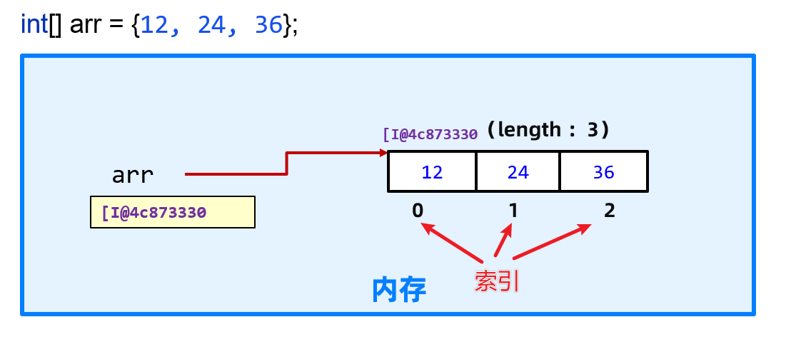
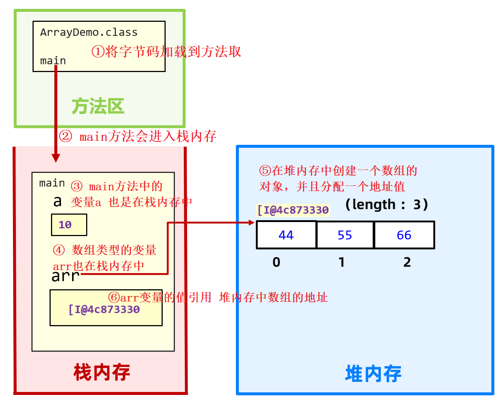

# 一维数组

## 什么是数组？

数组是具有相同数据类型且按一定次序排列的一组变量的集合体。

## 数组的应用场景

代码繁琐：大量变量的定义。

实现需求繁琐。

## 为什么需要数组？

结论：遇到批量数据的存储和操作时，数组比变量更适合


## 数组的访问


一维数组arr内的索引是从0开始依次递增的整数，如图所示

```java
//访问数组内的元素
int a = arr[0];
System.out.println(a);//12
```


## 增强for循环的问题

```java
int[] arr = new int[] {1, 2, 3, 4};
for (int i : arr){ sout（i） }
```

无法赋值

无法拿到元素的下标

`适用于仅需要进行遍历的数组`


## 数组的初始化

### 动态初始化

```java
// 数据类型[] 数组名 = new 数据类型[长度];
int[] arr = new int[5];
后边的int[]填入长度
```
### 初始值

| 数组元素类型           | 默认初始值         |
| ---------------------- | ------------------ |
| byte，short，int，long | 0                  |
| float，double          | 0.0                |
| char                   | '\u0000'（空字符） |
| boolean                | false              |
| 引用数据类型           | null               |


### 静态初始化

```java
int[] arr = new int[] {1,2,3,4};
or
int[] arr = {1,2,3,4};// 简写
```


## 数组的遍历

```java
//使用for循环
for(int i=0; i<arr.length;i++){
    System.out.println(i);
        }

//使用增强for循环进行遍历
for(int i : arr){
    System.out.println(i);
        }
//其中i为数组arr中的每个元素

//使用.toString()方法
System.out.println(Arrays.toString(arr));
//[1, 2, 3, 4, 5]


```
## 数组地址问题

Java为了便于虚拟机执行Java程序，将虚拟机的内存划分为 方法区、栈、堆、本地方
法栈、寄存器 这5块区域。

同学们需要重点关注的是 方法区、栈、堆。

**方法区**：字节码文件先加载到这里

```java
Random rand = new Random();
Scanner sc = new Scanner(System.in);
```

**栈**：方法运行时所进入的内存区域，由于变量在方法中，所以变量也在这一块
区域中

**堆**：存储new出来的东西，并分配地址。由于数组是new 出来的，所以数组也在
这块区域。



执行顺序，如图

```java
//int a是基本数据类型变量，在栈中，a的变量存储的就是10这个数据
int a =10;

//这里的int[] arr是个引用数据类型，存储的是地址值
int[] arr =new int[]{1,2,3,4,5,6,7,8,9,10};

```

### 多个变量指向同一个数组
```java
int[] arr =new int[]{1,2,3,4,5,6,7,8,9,10};
int[] arr1 = arr;
int[] arr2 = new int[]{1,2,3,4,5,6,7,8,9,10};

System.out.println(arr);//地址1
System.out.println(arr1);//地址1
System.out.println(arr2);//地址2
```


## 最值
```java
//数组求最大值思路：
//        1)先找出数组中0索引的元素，假设为最大值，用max表示【擂主】
//        2)遍历后面的每一个元素和max比较，把较大的元素值重新赋值给max(擂主换人)
//        3)最后max就是所有元素的最大值(最后站在台上的擂主)
int max = -9999;
int min = 9999;
for(int i=0;i<arr.length;i++){
    if(arr[i]>max)max=arr[i];//最大值
    else if(arr[i]<min)min=arr[i];//最小值
}
```

## 数组反转
```java
for(int i=0,int j=arr.length-1;i<arr.length/2;i++,j--){
        int temp=arr[i];
        arr[j]=arr[i];
        arr[i]=temp;
    }

//数组元素交换位置的方法
        
// 1. 使用中间值
int temp=arr[i];
arr[j]=arr[i];
arr[i]=temp;

// 2. 使用位运算
arr[i]=arr[i]^arr[j];
arr[j]=arr[i]^arr[j];
arr[i]=arr[i]^arr[j];
//原理
arr[i]=arr[i]^arr[j]
arr[j]=arr[i]^arr[j]^arr[j];
//arr[j]^arr[j]=0
//arr[j]=arr[i]
//下边同理s
```

## 排序

### 选择排序
表现最稳定的排序算法之一，因为无论什么数据进去都是O(n2)的时间复杂度，所 以用到它的时候，数据规模越小越好。

在未排序序列中，先找最大（小）的元素，存放在起始位置，然后找第二大(小)的元素，放在第一个排序好的元素后面，直到将所有元素都排序完

```java
//倒序
public static void main(String[] args) {
    int[] arr = new int[]{6, 7, 3, 2, 1};
    for (int i = 0; i < arr.length; i++) {
        int maxIndex = i;
        //第二个循环从j的值从i的下一位开始就行
        for (int j = i + 1; j < arr.length; j++) {
            if (arr[maxIndex] < arr[j]) {//找到每一轮中的元素最大值
                maxIndex = j;
            }
        }
        //交换
        int temp = arr[maxIndex];
        arr[maxIndex] = arr[i];
        arr[i] = temp;
    }
    System.out.println(Arrays.toString(arr));
}

//找最小值
public static void main(String[] args) {
    int[] arr = new int[]{6, 7, 3, 2, 1};
    for (int i = 0; i < arr.length; i++) {
        int minIndex = i;
        //j和上面一样
        for (int j = i + 1; j < arr.length; j++) {
            if (arr[j] < arr[minIndex]) minIndex = j;
        }
        //交换
        int temp = arr[minIndex];
        arr[minIndex] = arr[i];
        arr[i] = temp;
    }
    System.out.println(Arrays.toString(arr));
}


```


### 插入排序

```java
//插入排序，正序
int[] arr = new int[]{6, 7, 3, 2, 1};
for (int i = 1; i < arr.length; i++) {
    int prevIndex = i - 1;
    int current = arr[i];
    while (prevIndex >= 0 && current < arr[prevIndex]) {
        arr[prevIndex + 1] = arr[prevIndex];
        prevIndex--;
    }
    arr[prevIndex + 1] = current;
}
```

```java
//插入排序倒序
for (int i = 1; i < arr.length; i++) {
    int prevIndex = i - 1;
    int current = arr[i];
    while (prevIndex >= 0 && current < arr[prevIndex]) {
        arr[prevIndex + 1] = arr[prevIndex];
        prevIndex--;
    }
    arr[prevIndex + 1] = current;
}
```


### 冒泡排序
```java
    //冒泡排序正序
int[] arr = new int[]{6, 7, 3, 2, 1};
for (int i = 1; i < arr.length; i++) {
    for (int j = 0; j < arr.length - i; j++) {
        if (arr[j] > arr[j + 1]) {
            int temp = arr[j];
            arr[j] = arr[j + 1];
            arr[j + 1] = temp;
        }
    }
}
```

```java
//冒泡排序倒序
int[] arr = new int[]{6, 7, 3, 2, 1};
for (int i = 1; i < arr.length; i++) {
    for (int j = 0; j < arr.length - i; j++) {
        if (arr[j] < arr[j + 1]) {
            int temp = arr[j];
            arr[j] = arr[j + 1];
            arr[j + 1] = temp;
        }
    }
}
```


## 查找

### 普通遍历
```java
int[] arr = new int[]{6, 7, 3, 2, 1};
int target = 3;
for (int i = 0; i < arr.length; i++) {
    if ( arr[i]==target){
        System.out.println("第" + (i + 1) + "位");
        break;
    }
}
```

### 二分查找

```java
public static void main(String[] args) {
    int[] arr = new int[]{6, 7, 3, 2, 1};
    int target = 3;
    int left = 0;
    int right = arr.length - 1;

    while (left <= right) {
        int mid = (left + right) >> 1;

        if (target > arr[mid]) {
            left = mid + 1;
        } else if (target < arr[mid]) {
            right = mid - 1;
        } else {
            System.out.println(mid + 1);
            break;
        }
    }
}
```

通过中间值进行比较，中间值比目标大（左边界移动到中间值加一的位置），继续执行直到等于中间值。

```java
    public static void main(String[] args) {
        int[] arr = new int[]{6, 7, 3, 2, 1};
        int target = 5;
        int left = 0;
        int right = arr.length - 1;

        while (left <= right) {
            int mid = (left + right) >> 1;

            if (target > arr[mid]) {
                left = mid + 1;
            } else if (target < arr[mid]) {
                right = mid - 1;
            } else {
                System.out.println(mid + 1);
                break;
            }
        }
        if(left>right){
            System.out.println("数字不在列表中");
        }

    }
```

当数字不在列表中，left会大于right，进行检测就行


# 二维数组
```java
//形如
int[][] arr = new int[3][4];
```


使用二维数组同一维数组的步骤，

* （1）定义数组、
* （2）为数组元素分配内存、
* （3）数组元素初始化、
* （4）使用数组。下面主要 以二维数组为例进行讲解。

```java
定义二维数组的语法规则如下：
数据类型[ ][ ] 数组名;
或者
数据类型 数组名[ ][ ];
语法解析：
[][] 表示二维数组，前面的[ ]表示第一维，后面的[ ]表示第二维。
[][] 放在数组名的前面或后面都是正确的。


// 二维数组初始化
int[][] arr = new int[3][4]; // 动态初始化
// 动态初始化时，二维数组内的元素都有默认值，默认值和一维数组默认初始化一样   
        
arr[0][0] = 1;//为[0][0]元素赋值
int[][] arr1 = new int[][]{ // 静态初始化
{1, 2, 3},
{2, 3},
{3, 4, 5, 4}
};
```

## 二维数组的迭代

```java
//使用双重for循环进行遍历
for (int i = 0; i < arr1.length; i++) {
    System.out.println(arr1[i]);//第一个for循环打印了地址值
    for (int i1 = 0; i1 < arr1[i].length; i1++) {
        System.out.println(arr1[i][i1]);//数组元素的值
    }
}

//使用双重增强for循环对数组进行遍历
for (int[] t : arr1) {
    for (int a : t) {
        System.out.println(a);
    }
}
```


## 二维数组的交换


# 数组工具类

## **Arrays**类

| 方法                                            | 返回类型            | 说明                                                         |
| ----------------------------------------------- | ------------------- | ------------------------------------------------------------ |
| equals(array1,array2)                           | boolean             | 比较两个数组是否相等                                         |
| sort(array)                                     | void                | 对数组array的元素进行排序                                    |
| toString(array)                                 | String              | 将一个数组array转换成一个字符串                              |
| fill(array,val)                                 | void                | 把数组array的所有元素都赋值成val                             |
| copyOf(array,length)                            | 与array数据类型一致 | 把数组array复制成一个长度为length的新数组                    |
| binarySearch(array,val)                         | int                 | 查询元素值val在数组array中的下标                             |
| compare(array1,array2)                          | int                 | 按字典顺序比较数组,前面的数组大,返回大于0的值,反之返回小于0的值 |
| copyOfRange(arr,start,end)                      | 与array数据类型一致 | 将指定数组的指定范围复制到新数组中。                         |
| fill(arr,start,end, val)                        | void                | 将指定的值分配给指定数组的指定范围的每个元素。               |
| mismatch(array1,array2)                         | int                 | 查找并返回两个数组之间第一个不匹配的索引,如果未找到不匹配,则返回-1。 |
| mismatch(array1,start1,end1,array2,start2,end2) | int                 | 查找并返回指定范围内两个数组之间第一个不匹配的相对索引,如果未找到不匹配,则返回-1。 |


## **Arrays**类的应用

### 比较两个数组是否相等

Arrays类的equals()方法用于比较两个数组是否相等。只有当两个数组长度相等，对应位置的元素也一一相等时，该方法返回true，否则返回false。

### 对数组元素进行升序排序

Arrays类的sort()方法对数组的元素进行升序排序。

### 将数组转换成字符串 

Arrays类中提供了专门输出数组内容的toString()方法。该方法用于将一个数组转换成一个字符串。它按顺序把多个数组元素连在一起，多个数组元素之间使用英文逗号和空格隔开。利用这种方法可以很清楚地观察到各个数组元素的值。

### 将数组所有元素赋值为相同的值

Arrays类的fill(array,val)方法用于把数组array的所有元素都赋值为val

### 将数组赋值成一个长度为设定值的新数组

Arrays类的copyOf()方法把数组复制成一个长度为设定值的新数组。

System.arraycopy() 方法从指定的源数组复制一个数组，从指定位置开始，到目标数组的指定位置。该方法声明如下：

```java
public static void arrcopy(Object src, int srcPos, Object dest, int destPos, int length)
 
//src：这是源数组。
//srcPos：这是源数组中的起始位置。
//dest：这是目标数组。
//destPos：这是目标数据中的起始位置。
//length: 这是要复制的数组元素的数量。   
```

> Arrays类的copyOf(array,length)方法可以进行数组复制，把原数据复制成一个新数组，其中length是新数组的长度。如果length小于原数组的长度，则新数组就是原数组的前面length个元素；如果length大于原数组的长度，则新数组前面的元素就是原数组的所有元素，后面的元素是按照数组类型补充的默认值，如整数补充0，浮点数补充0.0等。

### 查询元素在数组中的下标

Arrays类的binarySearch(Object[],Object key)方法用于查询数组元素在数组中的下标。调用该方法时要求数组中的元素已经按升序排列。如果key在数组中，则返回搜索值的索引；如果key不在数组中，返回值-1或“-”（插入点）。插入点的值有如下四种情况。

[1] 搜索值是数组元素，从0开始计数，得搜索值的索引值；

[2] 搜索值不是数组元素，且在数组范围内，从1开始计数，得“ - 插入点索引值”；

[3] 搜索值不是数组元素，且大于数组内元素，索引值为 – (length + 1);

[4] 搜索值不是数组元素，且小于数组内元素，索引值为 – 1。


# 练习

## 杨辉三角

